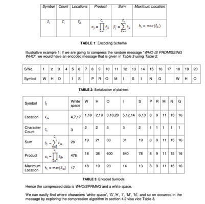

# Radical Data Compression Algorithm Using Factorization

Unofficial implementation of the data compression algorithm described in the research paper by Zirra Peter Buba & Gregory Maksha Wajiga (2011).




## Overview

This implementation provides a lossless data compression algorithm that combines factorization techniques with cryptographic properties. The algorithm encodes messages into a compressed form with fewer characters while simultaneously providing a level of data security.

### Key Features

- Lossless compression
- Built-in data security through encoding
- Separate compression and decompression keys
- Support for all printable ASCII characters
- Dual purpose: compression and basic encryption

## Algorithm Description

The compression process works through the following steps:

1. **Serialization**: Each character in the input string is assigned a numerical position
2. **Character Analysis**: For each unique character, calculate:
   - Count of occurrences
   - Locations where it appears
   - Product of all locations
   - Sum of all locations
   - Maximum location
3. **Compression**: Generate compressed output using only unique characters
4. **Key Generation**: Create decompression key using character metrics

The decompression process involves:
1. Using the decompression key to reconstruct character positions
2. Factorization of location products
3. Verification against sums and maximum locations
4. Character placement in original positions

## Implementation Details

Available in two programming languages:
- C implementation (`radical_compression.c`)
- Python implementation (`radical_compressor.py`)

### Usage Example

```python
# Python
compressor = RadicalCompressor()
text = "WHO IS PROMISSING WHO"
compressed, encoding_table = compressor.compress(text)
decompressed = compressor.decompress(compressed, encoding_table)
```
To run:
```python
python radical_compression.py
```

```c
// C
const char* text = "WHO IS PROMISSING WHO";
EncodingTable table = compress(text);
char* decompressed = decompress(&table);
```
To compile and run:
```c
gcc radical_compression.c -o radical_compression
./radical_compression
```

<pre>
<span style="color: #89B4FA">⬤</span> <span style="color: #B4B4B4">(base)</span> <span style="color: #89B482">➜</span>  <span style="color: #89B4FA">radical-compression</span> <span style="color: #B4B4B4">gcc radical_compression.c -o radical_compression</span>
<span style="color: #B4B4B4">./radical_compression</span>
<span style="color: #B4B4B4">Original text length: 21</span>
<span style="color: #B4B4B4">Compressed text length: 11</span>
<span style="color: #B4B4B4">Compression ratio: 52.38%</span>
<span style="color: #B4B4B4">Successful roundtrip: Yes</span>

<span style="color: #B4B4B4">Original text: WHO IS PROMISSING WHO</span>
<span style="color: #B4B4B4">Compressed chars: WHO ISPRMNG</span>
<span style="color: #B4B4B4">Decompressed text: WHO IS PROMISSING WHO</span></pre>

## Security Considerations

As noted in the original paper:
1. The decompression key should be transmitted through a separate channel (email, SMS)
2. The algorithm provides basic security through obscurity of the compressed output
3. The scheme is primarily designed for compression with added security benefits
4. Not intended as a standalone cryptographic solution

## Performance Characteristics

The algorithm provides:
- Text size reduction through elimination of repeated characters
- Additional storage overhead for encoding table
- O(n) compression time complexity
- O(n*m) decompression time complexity (where m is the number of factors)

## Limitations

1. Compression ratio depends heavily on character repetition
2. Encoding table must be transmitted separately
3. Not optimized for very large text files
4. Limited cryptographic strength compared to modern standards

## Original Paper Abstract

> "This work deals with encoding algorithm that conveys a message that generates a 'compressed' form with fewer characters only understood through decoding the encoded data which reconstructs the original message. The proposed factorization techniques in conjunction with lossless method were adopted in compression and decompression of data for exploiting the size of memory, thereby decreasing the cost of the communications. The proposed algorithms shade the data from the eyes of the cryptanalysts during the data storage or transmission."

## Paper Citation

```
Zirra Peter Buba & Gregory Maksha Wajiga (2011). Radical Data Compression Algorithm Using Factorization. 
International Journal of Computer Science and Security (IJCSS), Volume (5) : Issue (2) : 2011, 221-226.
DOI: N/A
ResearchGate: https://www.researchgate.net/publication/228872518_Radical_Data_Compression_Algorithm_Using_Factorization
```

## License

This implementation is provided for educational and research purposes. Please refer to the original paper for any usage restrictions.

## Authors

Original Paper Authors:
- Zirra Peter Buba (Adamawa State University)
- Gregory Maksha Wajiga (Federal University of Technology)

Implementation based on the published algorithm in the International Journal of Computer Science and Security (IJCSS), Volume (5) : Issue (2) : 2011.